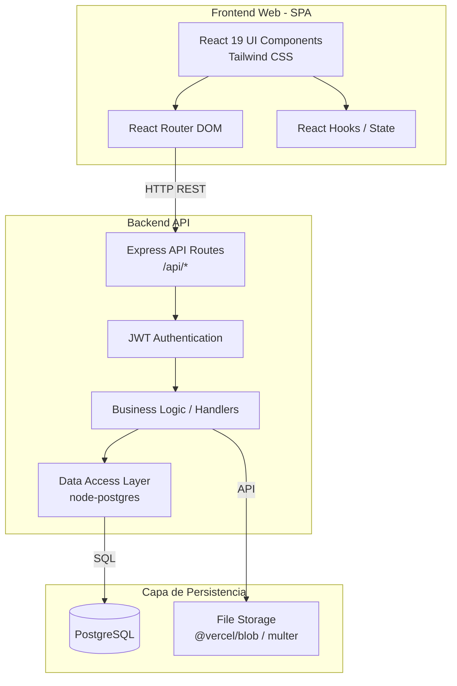

# Arquitectura del Sistema

## Patrón Arquitectónico
El proyecto sigue actualmente un modelo **Cliente-Servidor (Monolito Modular / API Frontend-Backend acoplados en el mismo repositorio)**. 
-   **Frontend:** Funciona como una Single Page Application (SPA).
-   **Backend:** Funciona como una API RESTful stateless. Aunque el entorno local utiliza Express como servidor para emular funciones serverless, la estructura de la carpeta `/api` está diseñada bajo un paradigma de funciones orientadas a rutas (similar a Vercel Serverless Functions).
-   **Base de Datos:** Relacional, centralizada.

El diseño interno se acerca a un modelo de separación por dominios y capas en el frontend (`src/presentation`, `src/domain`, `src/data`).

## Flujo de Datos
1.  El usuario interactúa con la interfaz de usuario (React Hojas/Páginas).
2.  Las interacciones disparan peticiones HTTP (fetch/axios) hacia los endpoints REST en la ruta `/api/`.
3.  El Backend (Node.js/Express) intercepta la petición, verifica la autenticación mediante middleware (JWT) y procesa la lógica de negocio.
4.  El Backend realiza consultas SQL a través del driver `pg` hacia PostgreSQL.
5.  PostgreSQL retorna los resultados al Backend, que los formatea en JSON y los devuelve al Frontend.
6.  El Frontend actualiza el estado de la aplicación y re-renderiza la vista de forma reactiva.

## Diagrama de Componentes

